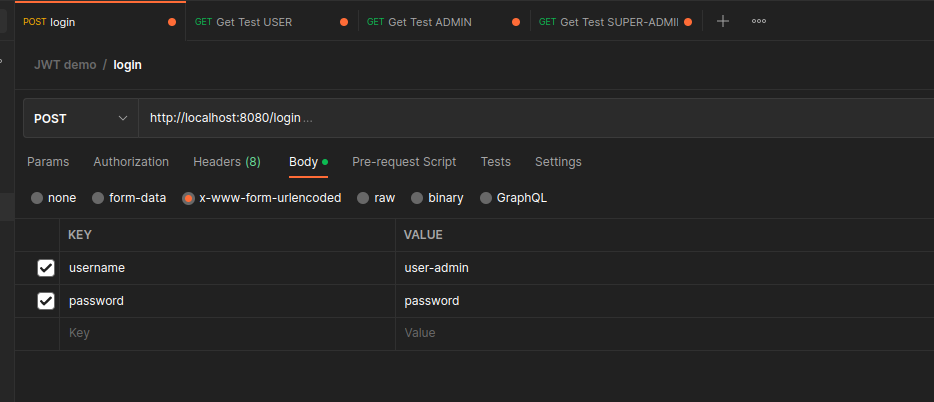
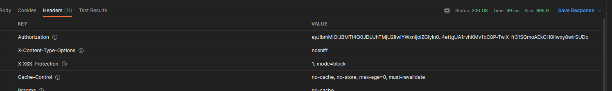
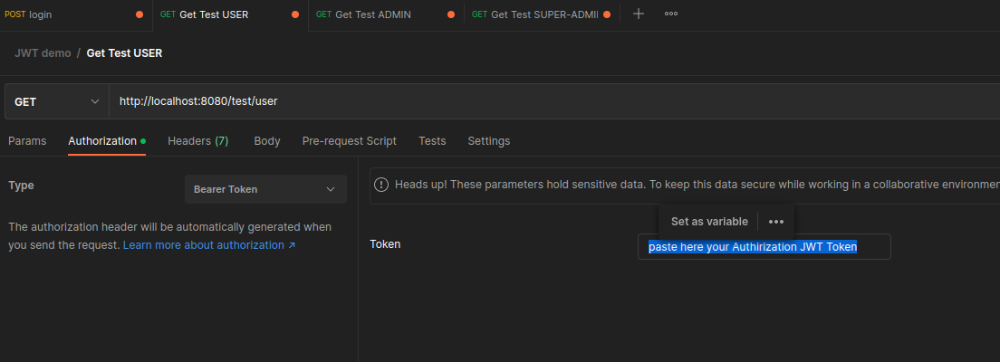
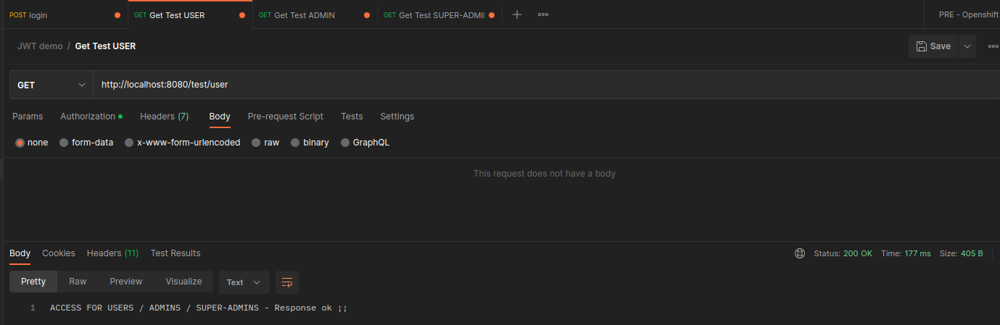

# Authentication and Authorization with JWT

#### Spring Boot 2.7.7 / Java 11 / JWT nimbus 9.27

## Authentication
"Authentication is a process that verifies that someone or something is who they say to are"

In this example the Authentication process verify with user/password credentials 
(regular login) that the user have access to the system. 

There are already a few users hardcoded in the system for testing, in a real application this hardcoded users 
must be implemented with a repository of users or a user-credential store. 

| USER NAME   | PASSWORD | ROL GRANTED      |
|-------------|----------|------------------|
| user        | password | ROLE_USER        |
| user-admin  | password | ROLE_ADMIN       |
| super-admin | password | ROLE_SUPER-ADMIN |       

## Authorization
"Authorization is the security process that determines if a user have access to a resource"

In this example the Authorization process verify the Rol of access of the user authenticated.
Each protected resources in the system have a level of access. 
The protected resources and their level of access are this:
+ http://localhost:8080/test/user
    + ROL_USER, ROLE_ADMIN, ROLE_SUPER-ADMIN
+ http://localhost:8080/test/admin
    + ROLE_ADMIN, ROLE_SUPER-ADMIN
+ http://localhost:8080/test/super-admin
    + ROLE_SUPER-ADMIN

## Testing the demo
You can find a postman collection in the folder /doc/postman for check the demo
  
#### Login

  
#### Login response ok 

  
#### Use the token from login in the Authorization - Bearer Token 

  
#### Access ¡¡
